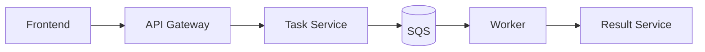

# Cloud Platform Reference

Production-grade async task platform reference implementation for AWS/EKS.

## Goal
Demonstrate platform engineering capabilities: GitOps, multi-account AWS, autoscaling,
observability, security policy enforcement, and progressive delivery.

## Architecture
Flow: Frontend → API Gateway → Task Service → SQS → Worker → Result Service

## Repo structure
- `infra/`: Terragrunt/Terraform for AWS accounts, networking, and EKS
- `platform/`: GitOps-managed platform components (Argo CD, observability, security)
- `apps/`: Demo applications and workload manifests
- `docs/`: Architecture, ADRs, and runbooks

## Standards
- Conventional Commits (see `CONTRIBUTING.md`)
- Pre-commit hooks in `.pre-commit-config.yaml`
- `make lint` and `make fmt` for basic checks

## Docs
- Project context: `docs/project-context.md`
- Roadmap: `docs/roadmap.md`
- ADRs: `docs/adr/`

